# WiFi Pineapple Pager - Bash Functions Cheat Sheet

<div align="center">


**Complete reference guide for all bash functions available on the WiFi Pineapple Pager**

[Quick Start](#quick-start) • [Functions](#functions) • [Categories](#categories)

</div>

---

## 📋 Table of Contents

- [Overview](#overview)
- [Architecture Diagram](#architecture-diagram)
- [Quick Start](#quick-start)
- [Function Categories](#function-categories)
  - [User Interface & Interaction](#user-interface--interaction)
  - [WiFi Operations](#wifi-operations)
  - [PineAP Operations](#pineap-operations)
  - [Network & VPN](#network--vpn)
  - [GPS Operations](#gps-operations)
  - [System Operations](#system-operations)
  - [LED & Display](#led--display)
  - [Logging & Data Collection](#logging--data-collection)
  - [Payload Configuration](#payload-configuration)
  - [USB Operations](#usb-operations)

---

## Overview

This cheat sheet contains all available bash functions for the **WiFi Pineapple Pager**, a powerful penetration testing and WiFi security research device. These functions allow you to programmatically control various aspects of the device including WiFi operations, network configuration, GPS tracking, and user interactions.

> **⚠️ Legal Notice**: Use of these functions in a setup script indicates your acceptance of the Hak5 Software License Agreement and Terms of Service. Always ensure you have proper authorization before using these tools.

---

## Architecture Diagram

```mermaid
graph TB
    A[WiFi Pineapple Pager] --> B[WiFi Operations]
    A --> C[PineAP Engine]
    A --> D[Network Services]
    A --> E[GPS Module]
    A --> F[User Interface]
    
    B --> B1[Client Mode]
    B --> B2[AP Mode]
    B --> B3[Management AP]
    
    C --> C1[SSID Pool]
    C --> C2[MAC Filtering]
    C --> C3[Deauth Attacks]
    C --> C4[Recon Sessions]
    
    D --> D1[OpenVPN]
    D --> D2[WireGuard]
    D --> D3[AutoSSH]
    D --> D4[DNS Spoofing]
    
    E --> E1[Location Tracking]
    E --> E2[Wigle Integration]
    
    F --> F1[Alerts & Dialogs]
    F --> F2[Input Pickers]
    F --> F3[LED Control]
    F --> F4[Vibration]
    
    style A fill:#4a90e2,stroke:#333,stroke-width:3px,color:#fff
    style B fill:#50c878,stroke:#333,stroke-width:2px
    style C fill:#ff6b6b,stroke:#333,stroke-width:2px
    style D fill:#ffa500,stroke:#333,stroke-width:2px
    style E fill:#9b59b6,stroke:#333,stroke-width:2px
    style F fill:#3498db,stroke:#333,stroke-width:2px
```



---

## Quick Start

### Accepting Terms of Service

Before using the device, you must accept the terms:

```bash
# Accept Software License Agreement
SLA_ACCEPT --i-accept

# Accept Terms of Service
TOS_ACCEPT --i-accept
```

### Basic WiFi Connection

```bash
# Connect to a WiFi network
WIFI_CONNECT wlan0cli "MyNetwork" psk2 "password123"

# Wait for connection
WIFI_WAIT wlan0cli 30
```

### Create an Open Access Point

```bash
# Configure an open AP
WIFI_OPEN_AP wlan0open "FreeWiFi"

# Start advertising SSIDs
PINEAPPLE_SSID_POOL_START
```

---

## Function Categories

## User Interface & Interaction

### Alerts and Dialogs

#### `ALERT`
Raise a modal alert.

```bash
ALERT [MESSAGE]
```

**Example:**
```bash
ALERT "Connection established!"
```

---

#### `ALERT_RINGTONE`
Raise a modal alert with ringtone.

```bash
ALERT_RINGTONE [ring] [MESSAGE]
```

**Parameters:**
- `ring` - `true`/`false` - Play the alert ringtone

**Example:**
```bash
ALERT_RINGTONE true "Incoming connection!"
```

---

#### `PROMPT`
Raise a modal alert and wait for user to dismiss before continuing.

```bash
PROMPT [MESSAGE]
```

---

#### `ERROR_DIALOG`
Show the user an error dialog.

```bash
ERROR_DIALOG [text]
```

---

#### `CONFIRMATION_DIALOG`
Ask the user to confirm an action.

```bash
CONFIRMATION_DIALOG [text]
```

---

### Input Pickers

#### `IP_PICKER`
Ask the user to interactively enter an IP address.

```bash
IP_PICKER [title] [default IP]
```

**Example:**
```bash
IP_PICKER "Enter Target IP" "192.168.1.1"
```

---

#### `MAC_PICKER`
Ask the user to interactively enter a MAC address.

```bash
MAC_PICKER [title] [default mac]
```

---

#### `NUMBER_PICKER`
Ask the user to interactively enter a number.

```bash
NUMBER_PICKER [title] [default number]
```

---

#### `TEXT_PICKER`
Ask the user to interactively enter text.

```bash
TEXT_PICKER [title] [default text]
```

---

### Button Input

#### `WAIT_FOR_BUTTON_PRESS`
Wait for button input from a user.

```bash
WAIT_FOR_BUTTON_PRESS {button}
```

Returns the name of the button pressed by the user.

---

#### `WAIT_FOR_INPUT`
Wait for button input from a user, returns button pressed.

```bash
WAIT_FOR_INPUT
```

---

### Progress Indicators

#### `START_SPINNER`
Start a spinner (indeterminate progress indicator).

```bash
START_SPINNER [text]
```

Returns a spinner ID which is used with `STOP_SPINNER` to finish the interaction.

**Example:**
```bash
SPINNER_ID=$(START_SPINNER "Connecting...")
# ... do work ...
STOP_SPINNER $SPINNER_ID
```

---

#### `STOP_SPINNER`
Stop a spinner (indeterminate progress indicator).

```bash
STOP_SPINNER [id]
```

**Parameters:**
- `id` - Spinner ID to stop (from `START_SPINNER`)

---

### Audio & Vibration

#### `RINGTONE`
Play a ringtone.

```bash
RINGTONE {--vibrate} [rtttl | name]
```

**Parameters:**
- `--vibrate` - Vibrate in sync with the supplied ringtone
- `rtttl` - Ringtone encoded in RTTTL format
- `name` - Name of a saved ringtone

---

#### `VIBRATE`
Activate the vibration motor.

```bash
VIBRATE [rtttl | name]
```

**Parameters:**
- `rtttl` - Ringtone/vibration pattern encoded in RTTTL format
- `name` - Name of a saved ringtone

---

## WiFi Operations

### Client Mode

#### `WIFI_CONNECT`
Configure WiFi client behavior and connect to an AP.

```bash
WIFI_CONNECT [interface] [ssid] [encryption] {key} {bssid}
```

**Parameters:**
- `interface` - Interface to configure (typically `wlan0cli`)
- `ssid` - SSID to connect to
- `encryption` - Encryption configuration:
  - `open` - No encryption
  - `psk` - WPA PSK
  - `psk2` - WPA2 PSK
  - `sae` - WPA3 SAE (personal)
- `key` - Encryption key (or `NONE`)
- `bssid` - Specific BSSID (or `ANY`)

**Example:**
```bash
WIFI_CONNECT wlan0cli "MyNetwork" psk2 "mypassword" ANY
```

---

#### `WIFI_DISCONNECT`
Disconnect from a WiFi network.

```bash
WIFI_DISCONNECT [interface]
```

---

#### `WIFI_CLEAR`
Disconnect and clear a WiFi client configuration.

```bash
WIFI_CLEAR [interface]
```

---

#### `WIFI_WAIT`
Wait for WiFi client to establish a connection.

```bash
WIFI_WAIT [interface] [count]
```

**Parameters:**
- `interface` - WiFi client interface (typically `wlan0cli`)
- `count` - Optional number of seconds to wait

---

### Access Point Configuration

#### `WIFI_OPEN_AP`
Configure an open AP.

```bash
WIFI_OPEN_AP [interface] [ssid] {bssid}
```

**Parameters:**
- `interface` - WiFi interface (typically `wlan0open`)
- `ssid` - Open SSID
- `bssid` - Specific BSSID (or blank for default)

---

#### `WIFI_OPEN_AP_CLEAR`
Clear an open AP configuration.

```bash
WIFI_OPEN_AP_CLEAR [interface]
```

---

#### `WIFI_OPEN_AP_DISABLE`
Disable an open AP.

```bash
WIFI_OPEN_AP_DISABLE [interface]
```

---

#### `WIFI_OPEN_AP_HIDE`
Disable the open AP SSID.

> **Note:** A hidden SSID can still be discovered by common WiFi tools. Clients which have already observed the SSID will continue to show it after hiding.

```bash
WIFI_OPEN_AP_HIDE [interface]
```

---

#### `WIFI_WPA_AP`
Configure a WPA AP.

```bash
WIFI_WPA_AP [interface] [ssid] [encryption] [key] {bssid}
```

**Parameters:**
- `interface` - WiFi interface (typically `wlan0wpa`)
- `ssid` - Management SSID
- `encryption` - Encryption configuration:
  - `psk` - WPA PSK
  - `psk2` - WPA2 PSK
  - `sae-mixed` - WPA2 PSK/WPA3 SAE
  - `sae` - WPA3 SAE (personal)
- `key` - Encryption key
- `bssid` - Specific BSSID (or blank for default)

---

#### `WIFI_WPA_AP_CLEAR`
Clear a WPA AP configuration.

```bash
WIFI_WPA_AP_CLEAR [interface]
```

---

#### `WIFI_WPA_AP_DISABLE`
Disable a WPA AP.

```bash
WIFI_WPA_AP_DISABLE [interface]
```

---

#### `WIFI_WPA_AP_HIDE`
Disable the WPA AP SSID.

```bash
WIFI_WPA_AP_HIDE [interface]
```

---

#### `WIFI_MGMT_AP`
Configure a management AP.

```bash
WIFI_MGMT_AP [interface] [ssid] [encryption] [key] {bssid}
```

**Parameters:**
- `interface` - WiFi interface (typically `wlan0mgmt`)
- `ssid` - Management SSID
- `encryption` - Encryption configuration:
  - `psk2` - WPA2 PSK
  - `sae-mixed` - WPA2 PSK/WPA3 SAE
  - `sae` - WPA3 SAE (personal)
- `key` - Encryption key
- `bssid` - Specific BSSID (or blank for default)

---

#### `WIFI_MGMT_AP_CLEAR`
Clear a management AP configuration.

```bash
WIFI_MGMT_AP_CLEAR [interface]
```

---

#### `WIFI_MGMT_AP_DISABLE`
Disable a management AP.

```bash
WIFI_MGMT_AP_DISABLE [interface]
```

---

#### `WIFI_MGMT_AP_HIDE`
Disable the management AP SSID.

```bash
WIFI_MGMT_AP_HIDE [interface]
```

---

### Packet Capture

#### `WIFI_PCAP_START`
Start a pcap log via pineapd.

```bash
WIFI_PCAP_START
```

---

#### `WIFI_PCAP_STOP`
Stop a pcap log.

```bash
WIFI_PCAP_STOP
```

---

## PineAP Operations

### SSID Pool Management

#### `PINEAPPLE_SSID_POOL_ADD`
Add to the SSID advertising pool.

```bash
PINEAPPLE_SSID_POOL_ADD [ssid]
```

**Example:**
```bash
PINEAPPLE_SSID_POOL_ADD "FreeWiFi"
PINEAPPLE_SSID_POOL_ADD "Starbucks_WiFi"
```

---

#### `PINEAPPLE_SSID_POOL_DELETE`
Remove a SSID from the advertising pool.

```bash
PINEAPPLE_SSID_POOL_DELETE [ssid]
```

---

#### `PINEAPPLE_SSID_POOL_LIST`
List SSID advertising pool.

```bash
PINEAPPLE_SSID_POOL_LIST
```

---

#### `PINEAPPLE_SSID_POOL_CLEAR`
Clear the SSID advertisement pool.

```bash
PINEAPPLE_SSID_POOL_CLEAR
```

---

#### `PINEAPPLE_SSID_POOL_START`
Start advertising SSIDs from the SSID pool.

```bash
PINEAPPLE_SSID_POOL_START {random}
```

**Parameters:**
- `random` - Use pseudo-random BSSIDs on advertised SSIDs

> **Warning:** Randomizing the BSSID may cause issues with modern WiFi clients. Check the documentation for more information.

---

#### `PINEAPPLE_SSID_POOL_STOP`
Stop advertising the SSID pool.

```bash
PINEAPPLE_SSID_POOL_STOP
```

---

#### `PINEAPPLE_SSID_POOL_COLLECT_START`
Start collecting probe requests into the SSID impersonation pool.

```bash
PINEAPPLE_SSID_POOL_COLLECT_START
```

---

#### `PINEAPPLE_SSID_POOL_COLLECT_STOP`
Stop collecting probe requests into the SSID impersonation pool.

```bash
PINEAPPLE_SSID_POOL_COLLECT_STOP
```

---

### SSID Filtering

#### `PINEAPPLE_SSID_FILTER_ADD`
Add a SSID to a filter.

```bash
PINEAPPLE_SSID_FILTER_ADD [allow|deny] [ssid]
```

**Parameters:**
- `allow` - Add a SSID to the allow list. In allow mode, the Pineapple only accepts connections to a SSID in the allow list.
- `deny` - Add a SSID to the deny list. In deny mode, any SSID NOT in the deny list is allowed.

---

#### `PINEAPPLE_SSID_FILTER_DELETE`
Remove a SSID from a filter.

```bash
PINEAPPLE_SSID_FILTER_DELETE [allow|deny] [ssid]
```

---

#### `PINEAPPLE_SSID_FILTER_LIST`
List SSID filters.

```bash
PINEAPPLE_SSID_FILTER_LIST [allow|deny]
```

---

#### `PINEAPPLE_SSID_FILTER_CLEAR`
Clear a SSID filter.

```bash
PINEAPPLE_SSID_FILTER_CLEAR [allow|deny]
```

---

#### `PINEAPPLE_SSID_FILTER_MODE`
Set SSID filter mode.

```bash
PINEAPPLE_SSID_FILTER_MODE [allow|deny]
```

**Parameters:**
- `allow` - Only allow SSIDs listed in the SSID filter allow list to connect
- `deny` - Allow any SSIDs NOT LISTED in the SSID filter deny list to connect

---

### MAC Filtering

#### `PINEAPPLE_MAC_FILTER_ADD`
Add a MAC address to a filter.

```bash
PINEAPPLE_MAC_FILTER_ADD [allow|deny] [mac]
```

**Parameters:**
- `allow` - Add a MAC to the allow list. In allow mode, only devices in the allowed list can connect
- `deny` - Add a MAC to the deny list. In deny mode, any device NOT in the deny list can connect
- `mac` - MAC address to add

---

#### `PINEAPPLE_MAC_FILTER_DELETE`
Remove a MAC address from a filter.

```bash
PINEAPPLE_MAC_FILTER_DELETE [allow|deny] [mac]
```

---

#### `PINEAPPLE_MAC_FILTER_LIST`
List MAC filters.

```bash
PINEAPPLE_MAC_FILTER_LIST [allow|deny]
```

---

#### `PINEAPPLE_MAC_FILTER_CLEAR`
Clear a MAC filter.

```bash
PINEAPPLE_MAC_FILTER_CLEAR [allow|deny]
```

**Parameters:**
- `allow` - Clear the allow filter list (no devices will be able to connect)
- `deny` - Clear the deny filter list (any device will be able to connect)

---

#### `PINEAPPLE_MAC_FILTER_MODE`
Set MAC filter mode.

```bash
PINEAPPLE_MAC_FILTER_MODE [allow|deny]
```

**Parameters:**
- `allow` - Only allow devices listed in the MAC filter allow list to connect
- `deny` - Allow any device NOT LISTED in the MAC filter deny list to connect

---

### Channel Operations

#### `PINEAPPLE_EXAMINE_BSSID`
Lock to the channel of a given BSSID.

```bash
PINEAPPLE_EXAMINE_BSSID [bssid] {time}
```

**Parameters:**
- `bssid` - BSSID
- `time` - Time (in seconds)

---

#### `PINEAPPLE_EXAMINE_CHANNEL`
Lock to a given channel.

```bash
PINEAPPLE_EXAMINE_CHANNEL [channel] {time}
```

**Parameters:**
- `channel` - WiFi channel
- `time` - Time (in seconds)

---

#### `PINEAPPLE_EXAMINE_RESET`
Stop examining a single channel.

```bash
PINEAPPLE_EXAMINE_RESET
```

---

#### `PINEAPPLE_SET_BANDS`
Set monitoring bands.

```bash
PINEAPPLE_SET_BANDS [interface] {2} {5} {6}
```

**Parameters:**
- `interface` - WiFi interface (typically `wlan1mon`)
- `2` - Monitor 2.4GHz channels
- `5` - Monitor 5GHz channels
- `6` - Monitor 6GHz channels

---

### Reconnaissance

#### `PINEAPPLE_RECON_NEW`
Start a new PineAP recon session.

```bash
PINEAPPLE_RECON_NEW {name}
```

**Parameters:**
- `name` - Recon name (optional)

---

### Deauthentication

#### `PINEAPPLE_DEAUTH_CLIENT`
Use PineAP to attempt to disconnect a Wi-Fi client.

```bash
PINEAPPLE_DEAUTH_CLIENT [bssid] [target] [channel]
```

**Parameters:**
- `bssid` - BSSID (MAC address of AP) to mimic
- `target` - MAC address of client device to disconnect
- `channel` - Channel to send disconnect packets on

---

## Network & VPN

### AutoSSH

#### `AUTOSSH_CONFIGURE`
Control and configure the AUTOSSH tool.

```bash
AUTOSSH disable
AUTOSSH enable [host] [port] [user] [remoteport] [localport]
```

---

#### `AUTOSSH_ADD_PORT`
Control and configure the AUTOSSH tool port forward.

```bash
AUTOSSH_ADD_PORT local [localport] [host] [remoteport]
AUTOSSH_ADD_PORT remote [localport] [host] [remoteport]
```

---

#### `AUTOSSH_ENABLE`
Enable the AUTOSSH tool.

> AutoSSH must be configured before it can be enabled; this command is only useful for enabling an existing configuration.

```bash
AUTOSSH_ENABLE
```

---

#### `AUTOSSH_DISABLE`
Disable the AUTOSSH tool.

```bash
AUTOSSH_DISABLE
```

---

#### `AUTOSSH_CLEAR`
Clear the AUTOSSH configuration.

```bash
AUTOSSH_CLEAR
```

---

### OpenVPN

#### `OPENVPN_CONFIGURE`
Configure the OpenVPN client.

```bash
OPENVPN_CONFIGURE disable
OPENVPN_CONFIGURE enable [config file]
```

---

#### `OPENVPN_ENABLE`
Enable the OpenVPN client.

> OpenVPN must be configured before it can be enabled; this command is only useful for enabling an existing configuration.

```bash
OPENVPN_ENABLE
```

---

#### `OPENVPN_DISABLE`
Disable the OpenVPN client.

```bash
OPENVPN_DISABLE
```

---

### WireGuard

#### `WIREGUARD_CONFIGURE`
Configure the Wireguard client.

> A Wireguard configuration can be relatively complex and difficult to perform with a single command; this command is primarily intended for use in automated device setup scripts.

```bash
WIREGUARD_CONFIGURE disable
WIREGUARD_CONFIGURE enable [wg.conf]
WIREGUARD_CONFIGURE enable [server-ip] [server-port] [server-pubkey] \
  [server-psk | NONE] [private-key | AUTO] [local-ip] \
  [ipv4-networks | NONE] [ipv6-networks | NONE]
```

---

#### `WIREGUARD_ENABLE`
Enable the Wireguard client.

> Wireguard must be configured before it can be enabled; this command is only useful for enabling an existing configuration.

```bash
WIREGUARD_ENABLE
```

---

#### `WIREGUARD_DISABLE`
Disable the Wireguard client.

```bash
WIREGUARD_DISABLE
```

---

### DNS Spoofing

#### `DNSSPOOF_ADD_HOST`
Add a host to the DNS override list.

```bash
DNSSPOOF_ADD_HOST A [hostname] [IPv4 address]
DNSSPOOF_ADD_HOST AAAA [hostname] [IPv6 address]
```

**Example:**
```bash
DNSSPOOF_ADD_HOST A "example.com" "192.168.1.100"
```

---

#### `DNSSPOOF_DEL_HOST`
Remove a host from the DNS override list.

```bash
DNSSPOOF_DEL_HOST A [hostname] [IPv4 address]
DNSSPOOF_DEL_HOST AAAA [hostname] [IPv6 address]
```

---

#### `DNSSPOOF_ENABLE`
Enable the DNS override subsystem.

> DNS overrides must be configured before it can be enabled; this command is only useful for enabling an existing configuration.

```bash
DNSSPOOF_ENABLE
```

---

#### `DNSSPOOF_DISABLE`
Disable the DNS override subsystem.

```bash
DNSSPOOF_DISABLE
```

---

#### `DNSSPOOF_CLEAR`
Clear and disable the DNS override subsystem.

```bash
DNSSPOOF_CLEAR
```

---

### System DNS

#### `SYSTEM_DNS`
Control and configure the DNS server used by the system.

```bash
SYSTEM_DNS DHCP
SYSTEM_DNS [IP]
```

**Example:**
```bash
SYSTEM_DNS 8.8.8.8
```

---

### Client Information

#### `FIND_CLIENT_IP`
Get information about a connected client device.

```bash
FIND_CLIENT_IP [mac] {timeout}
```

**Parameters:**
- `mac` - MAC address of the client, in `aa:bb:cc:dd:ee:ff` form
- `timeout` - (optional) amount of time to wait for the client to use an IP

---

## GPS Operations

### GPS Configuration

#### `GPS_CONFIGURE`
Configure an attached GPS.

```bash
GPS_CONFIGURE [serial] {speed}
```

**Parameters:**
- `serial` - Serial port (such as `/dev/ttyUSB0`)
- `speed` - Optional baud rate of serial device

> Most GPS units will operate at a speed of 9600, however some may operate on higher speeds. Consult the documentation for your GPS to find the speed setting required. GPS units can vary widely, make sure to check the Hak5 documentation for information!

---

#### `GPS_LIST`
List available serial GPS devices.

```bash
GPS_LIST
```

---

#### `GPS_GET`
Get the current GPS location.

Returns the latitude, longitude, altitude, and speed, if known. Requires GPS hardware and a GPS positional lock.

```bash
GPS_GET
```

---

## System Operations

### Password Management

#### `PASSWORD`
Set the admin/root password of the device.

```bash
PASSWORD [password]
```

---

### Firmware

#### `INSTALL_FIRMWARE`
Validate and install a firmware file.

```bash
INSTALL_FIRMWARE [file]
```

---

### SSH Configuration

#### `SSH_ADD_KNOWN_HOST`
Add a known host to SSH.

> The ssh-keytool command can be used to collect the remote host fingerprint.

```bash
SSH_ADD_KNOWN_HOST [hostname] [keytype] [keydata]
```

---

## LED & Display

### LED Control

#### `LED`
Configure the LED.

```bash
LED [COLOR] [PATTERN]
LED [STATE]
```

---

### DPAD LED

#### `DPADLED`
Change the DPAD LED color.

```bash
DPADLED [color]
```

**Parameters:**
- `color` - Color of the DPAD LEDs (`red`, `green`, `blue`, `cyan`, `yellow`, `magenta`, `white`, `off`)

---

#### `DPADLED_CONFIG`
Change the default DPAD LED color.

```bash
DPADLED_CONFIG [color]
```

---

### Display Control

#### `ENABLE_DISPLAY`
Enable the display.

```bash
ENABLE_DISPLAY
```

---

#### `DISABLE_DISPLAY`
Disable the display.

```bash
DISABLE_DISPLAY
```

---

## Logging & Data Collection

### Logging

#### `LOG`
Send data to the currently running payload log.

```bash
LOG {COLOR} MESSAGE
```

---

### Wigle Integration

#### `WIGLE_LOGIN`
Interactively configure Wigle integration.

```bash
WIGLE_LOGIN {username} {password}
```

**Parameters:**
- `username` - (optional) username
- `password` - (optional) password

> If username and password are passed on the command line, `WIGLE_LOGIN` will automatically attempt to retrieve a Wigle API token.

---

#### `WIGLE_LOGOUT`
Remove any Wigle API tokens.

```bash
WIGLE_LOGOUT
```

---

#### `WIGLE_START`
Start a Wigle log (requires a physical GPS).

```bash
WIGLE_START
```

---

#### `WIGLE_STOP`
Stop a Wigle log.

```bash
WIGLE_STOP
```

---

#### `WIGLE_UPLOAD`
Upload Wigle log files.

> You must create an account on the Wigle service at https://www.wigle.net and obtain an upload token on this device using the `WIGLE_LOGIN` command. Wigle is not affiliated or associated with Hak5, and uploads to the Wigle service are subject to the Wigle security and privacy policies.

```bash
WIGLE_UPLOAD {--archive} {--remove} [/path/to/file] [path/to/additional/file]
```

**Parameters:**
- `--archive` - (optional) Move uploaded files to the loot archive in `/root/loot/archive/wigle/`
- `--remove` - (optional) Remove uploaded files

---

## Payload Configuration

### Configuration Management

#### `PAYLOAD_SET_CONFIG`
Store a permanent payload configuration option.

```bash
PAYLOAD_SET_CONFIG [payload] [option] [value]
```

**Parameters:**
- `payload` - Payload simple name (must not contain spaces, etc)
- `option` - Option name (must not contain spaces, etc)
- `value` - Value to store

> Payload names must be simple text names, with no spaces. A payload name should be unique. Option names must be simple text, with no spaces. A value should be quoted if it contains spaces or special characters.

---

#### `PAYLOAD_GET_CONFIG`
Retrieve a permanent payload configuration option.

```bash
PAYLOAD_GET_CONFIG [payload] [option]
```

---

#### `PAYLOAD_DEL_CONFIG`
Delete a permanent payload configuration option.

```bash
PAYLOAD_DEL_CONFIG [payload] [option]
```

---

## USB Operations

### USB Storage

#### `USB_STORAGE`
Manage USB storage.

```bash
USB_STORAGE
```

---

#### `USB_WAIT`
Wait for USB device.

```bash
USB_WAIT
```

---

#### `USB_FREE`
Free USB resources.

```bash
USB_FREE
```

---

#### `USB_EJECT`
Safely eject a mounted USB device.

```bash
USB_EJECT
```

---

## Developer Functions

#### `DEVELOPER_THEME_RELOAD`
Reload theme from disk for currently focused UI element.

```bash
DEVELOPER_THEME_RELOAD {component name}
```

> Default component is the current and should be used in most cases. Use the optional component override with caution.

---

## Special Functions

#### `DO_A_BARREL_ROLL`
Perform a barrel roll.

```bash
DO_A_BARREL_ROLL
```

---

## Legal & Terms

### Software License Agreement

Before using the device, you must accept the Software License Agreement:

```bash
SLA_ACCEPT --i-accept
```

The full agreement can be found at: https://hak5.org/products/pineapple/pineapplepager/legal_sla

### Terms of Service

You must also accept the Terms of Service:

```bash
TOS_ACCEPT --i-accept
```

The full terms can be found at: https://hak5.org/products/pineapple/pineapplepager/legal_tos

---

## 📚 Resources

- [Hak5 Official Website](https://hak5.org)
- [WiFi Pineapple Pager Documentation](https://docs.hak5.org/pineapple-pager)
- [Hak5 Forums](https://forums.hak5.org)

---

## ⚠️ Disclaimer

This cheat sheet is for educational and authorized security testing purposes only. Always ensure you have proper authorization before using these tools. Unauthorized access to computer systems is illegal and unethical.

---

## 📝 License

This cheat sheet is provided as-is for educational purposes. Refer to Hak5's official documentation and terms of service for official information.

---

<div align="center">

**Made with ❤️ for the WiFi Pineapple Pager community**

⭐ Star this repo if you find it helpful!

</div>

